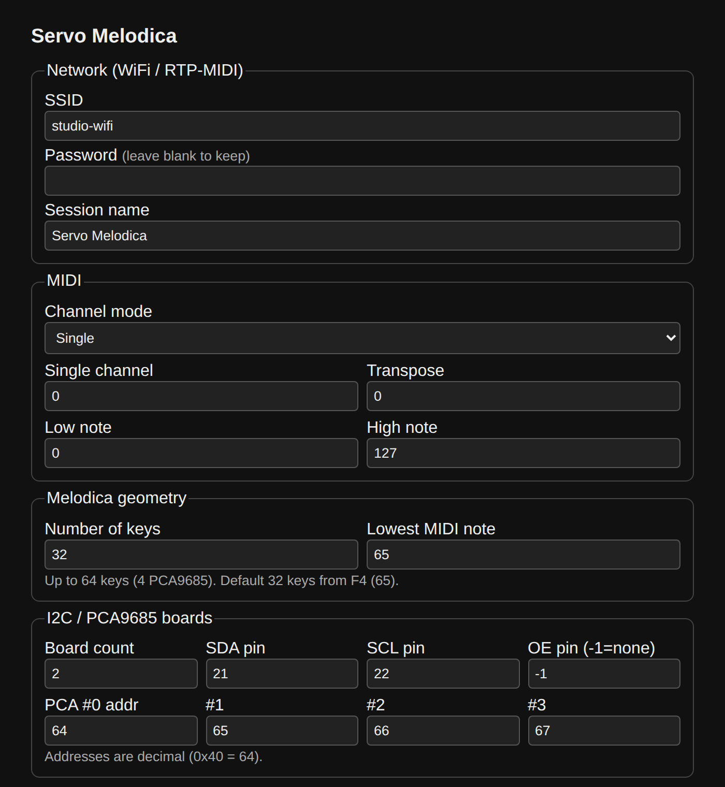
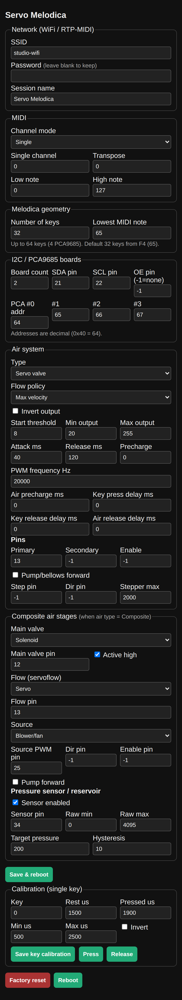

# 🎹 Servo Melodica

**Turn a melodica into a MIDI robot.** One ESP32 firmware presses the keys with
servos and pushes the air for you — plug in any MIDI source (your DAW, a
keyboard, a Raspberry Pi) and it plays.

- 🧩 **One firmware, every setup** — the same code runs on BLE, WiFi, USB, DIN
  or serial builds. No duplicated logic, no five sketches to maintain.
- 🌬️ **Any air system** — servo valve, solenoid, blower, pump, bellows… pick it
  in a web page, no re-flashing.
- 🌐 **Configure from your browser** — keys, pins, air, MIDI and per-key
  calibration, all from a phone or laptop. A built-in WiFi hotspot means you
  never need a cable to set it up.
- 🛠️ **Builds anywhere** — open it in the Arduino IDE or build with PlatformIO,
  same source tree.
- ✅ **Tested on your PC** — the instrument core runs and passes unit tests with
  no ESP32 plugged in.

> Replaces the old five parallel sketches. See [`MIGRATION.md`](MIGRATION.md) if
> you're coming from those.

---

## 🚀 Quick start (Arduino IDE)

1. **Install ESP32 boards** — Boards Manager → search *"esp32"* by Espressif (3.x).
2. **Install libraries** via the Library Manager:
   *Adafruit PWM Servo Driver Library*, *ESP32Servo*, *MIDI Library*
   (FortySevenEffects). Add *AppleMIDI* for WiFi, *ESP32-BLE-MIDI* for BLE, or
   *Adafruit TinyUSB* for USB builds. (`WebServer`, `WiFi`, `Wire`, `Preferences`
   already ship with the ESP32 core.)
3. **Open** [`ServoMelodica/ServoMelodica.ino`](ServoMelodica/ServoMelodica.ino).
4. **Pick your MIDI transport** at the top of `UserConfig.h` (uncomment one
   `TRANSPORT_*`). Default is **WiFi + RTP-MIDI**, which also turns on the web UI.
5. **Select your board** (e.g. *ESP32 Dev Module*) and hit **Upload**.

That's it. You don't choose the air system at compile time — set it later in the
web page or the serial console.

**Prefer PlatformIO?** Jump to [Build profiles](#-build-profiles-platformio).

---

## ✨ What it can do

### 🎛️ MIDI transports — pick one per build

| Transport | Good for | Build flag |
|-----------|----------|-----------|
| 🔵 **BLE-MIDI** | Wireless from a phone/tablet/computer | `TRANSPORT_BLE` |
| 📶 **WiFi (RTP / AppleMIDI)** | Network MIDI + the web config page | `TRANSPORT_WIFI_RTP` |
| 🎹 **DIN MIDI** | Classic 5-pin MIDI cable | `TRANSPORT_DIN` |
| 🔌 **USB-MIDI** | Plug-and-play (ESP32-S2/S3 only) | `TRANSPORT_USB` |
| 🍓 **Serial** | Driven by a Raspberry Pi | `TRANSPORT_SERIAL` |

Every transport can filter and reshape incoming MIDI: single channel, channel
list or omni, transposition, note-range limits and note→servo remapping.

### 🌬️ Air systems — chosen at runtime

By default **all nine are compiled in** and you select the active one in the web
UI or serial console — one binary drives any air rig.

| Air module | What it drives |
|-----------|----------------|
| Proportional valve servo | A servo throttling airflow |
| On/off solenoid | Simple open/close valve |
| Stepped solenoids | Several valves = flow stages |
| DC blower / fan (PWM) | Speed-controlled fan |
| DC pump + H-bridge | Pump with direction control |
| Proportional valve (PWM/DAC) | Analog-controlled valve |
| Stepper-driven bellows | Motorised bellows |
| Permanent external air | Always-on supply, digital enable |
| Simulation | No hardware — for testing |

**Need more than one?** The **Composite** air type chains four configurable
stages, so *"a solenoid main valve + a servo throttle fed by a blower, regulated
by a pressure sensor"* is just settings — no code change:

```
Source ──► Main valve ──► Flow ──► melodica keys (servos on up to 4 PCA9685)
  ▲
Pressure sensor (optional, keeps a reservoir at target pressure)
```

**Smart airflow.** An *air policy* turns your active notes into the right amount
of air (`Fixed`, `MaximumVelocity`, `AverageVelocity`, `SumClamped`,
`PolyphonyCompensated`). It respects CC7 (volume) and CC11 (expression), and
**zero demand fully closes the air** — release the loudest note of a chord and
the flow drops on its own.

### 🎹 The keys

Up to **64 servo-driven keys** across up to four PCA9685 boards
(`board = key/16`, `channel = key%16`). Each key has its own calibration
(rest / pressed pulse, travel limits, inversion), stored on the device.

### 🛡️ Safe by design

A `SafetyManager` watches everything and forces the same safe state on any
critical fault — release every key, close the air, disable the servo outputs,
latch a readable fault code:

| Watchdog | Trips when |
|----------|-----------|
| I2C health | a PCA9685 stops answering — re-probed continuously, not just at boot |
| Transport loss | the MIDI link really drops (a held note is **not** a dropped link) |
| Comm timeout | no MIDI and no link while notes are still down |
| Stuck key | a key stays down longer than `maxKeyHoldMs` |
| **Pump overrun** | a pump/blower runs longer than `maxPumpRunMs` without a break |
| **Air not initialised** | an air module refuses to run (bad pin, reservoir with no sensor) |
| **Emergency stop** | a dedicated input changes state — acted on immediately |

**Wire a real emergency stop.** The BOOT button is a *configuration* control
(short press = local panic, long press = setup hotspot). For mechanical safety
set `safety.panicPin` in the web UI and use a normally-closed button to GND with
*"stop when HIGH"*: pressing it **or cutting the wire** stops the instrument.
See [`docs/WIRING.md`](docs/WIRING.md).

**Nothing impossible gets saved.** Every configuration is validated against the
chip before it is stored — 37 keys on two PCA9685 boards, a solenoid on the
input-only GPIO34, a DAC valve on a pin with no DAC, one GPIO wired to two jobs,
or a regulated reservoir with no pressure sensor are refused with an explanation,
not silently accepted.

---

## 🌐 Configure from your browser (WiFi builds)

No code editing needed — set up any melodica from a phone or laptop:

<p align="center">
  
</p>

<details>
<summary>📱 See the whole page (one scroll: network, MIDI, air system, composite stages, calibration)</summary>

<p align="center">
  
</p>

</details>


- **Live status** — what the instrument is doing, and why it stopped: fault code,
  transport link, active keys, air duty, I2C health, IP and uptime. With a remote
  **STOP** and a **Clear fault** button.
- **Melodica geometry** — number of keys (up to 64) and the lowest MIDI note.
- **I2C / PCA9685** — board count (1–4), addresses, SDA/SCL and OE pins, I2C
  clock, servo PWM frequency, **servo speed** (slew rate) and the I2C health-check
  interval.
- **Air system** — type, all parameters and pins, LEDC channel/resolution,
  solenoid stage pins, including the full composite stack and pressure sensor.
- **MIDI** — channel mode with **16 per-channel checkboxes** for the channel
  list, transposition, note range.
- **Safety** — every watchdog limit, plus the emergency-stop pin and its polarity.
- **Per-key calibration** — for **all** keys (0–63, not just the first 32), with
  the real stored values loaded when you pick a key, and live **Press / Release**
  buttons that move the servo so you can set rest/pressed positions by eye.

Anything the hardware cannot honour is listed at the top of the page before you
save, and saving is refused until you fix it (or explicitly choose *Save anyway*).

Everything saves to the device (NVS). Saving reboots to apply — **never a
recompile.**

**How to reach the page**

- 📡 **First time / no network?** Long-press the **BOOT button (≥ 3 s)** to start
  the **`ServoMelodica-Setup`** WiFi hotspot, connect to it, and open
  <http://192.168.4.1/>.
- 🌍 **Already on your network?** Browse to the device's IP (shown on the serial
  monitor and in the RTP session).

> On BLE/DIN/USB builds you configure the same things over the serial console
> instead (`air <type>`, `pol <policy>`, calibration commands, then `s` to save
> and `reboot`).

---

## 🎚️ Calibration (built in)

No separate calibration firmware. Open the serial monitor at **115200 baud**,
type `?` for help:

```
k <n>    select key n            r <us>   set rest pulse
p <us>   set pressed pulse       lo <us>  set min limit
hi <us>  set max limit           v        toggle inversion
t        test selected key       ta       test all keys
d        reset key to default    s        save to device
x        export as C++           j        export as JSON
val      check the config        reboot   restart the board
```

Changes apply live, save without recompiling, and export as C++ or JSON. Don't
save? The old values come back on reboot. WiFi builds also expose this in the
web UI.

---

## 🔌 Wiring (at a glance)

Full table in [`docs/WIRING.md`](docs/WIRING.md).

| Signal | GPIO | Notes |
|--------|------|-------|
| I2C SDA / SCL | 21 / 22 | PCA9685 boards |
| PCA OE (shared) | 27 | active-low output-disable (**not** a power cut) |
| Air actuator | 13 / 14 / 27 | depends on the selected module |
| DIN RX / TX | 16 / 17 | via opto-isolator, 31250 baud |
| Setup / config button | 0 | BOOT button — short = local panic, long = setup hotspot |
| **Emergency stop** | your choice | normally-closed button to GND, set in the web UI |

Key → board/channel: `board = key/16`, `channel = key%16` (16 channels per board).

---

## 🧰 Compatible boards

| Board | Transports | Native USB-MIDI |
|-------|-----------|-----------------|
| ESP32 DevKit / WROOM (`esp32dev`) | BLE, WiFi, DIN | ❌ |
| ESP32-S3 (`esp32-s3-devkitc-1`) | USB, BLE, WiFi | ✅ |
| ESP32-S2 | USB | ✅ (no BLE) |
| Any host PC | *unit tests* | — |

Native USB-MIDI is compiled **only** for the S2/S3 — the classic ESP32 has no
USB device mode.

---

## 🏗️ Build profiles (PlatformIO)

The same tree also builds with PlatformIO. Each profile picks one transport (and
optionally trims to a single air module for a leaner binary):

```sh
pio run -e esp32_ble_servo_air          # BLE  + servo valve (lean)
pio run -e esp32_wifi_servo_air         # WiFi + all air modules + web UI  ← default
pio run -e esp32_din_servo_air          # DIN  + servo valve (lean)
pio run -e esp32_serial_servo_air       # Serial (Raspberry Pi) + servo valve (lean)
pio run -e esp32_ble_pwm_blower         # BLE  + PWM blower (lean)
pio run -e esp32_wifi_digital_valve     # WiFi + all air modules (default: solenoid)
pio run -e esp32_stepper_bellows        # BLE  + stepper bellows (lean)
pio run -e esp32s3_usb_servo_air        # S3 native USB + servo valve (lean)

pio run -e esp32_ble_servo_air -t upload    # flash  (append -t upload to any env)
pio run -e esp32_ble_servo_air -t monitor   # serial monitor
```

WiFi profiles compile **every** air module (runtime-selectable, web UI on);
`-DAIR_<X>` profiles are lean single-module binaries. Library versions are
pinned in [`platformio.ini`](platformio.ini) for reproducible builds.

---

## ✅ Test it without hardware

The instrument core runs on your PC with simulated drivers — no ESP32 required:

```sh
./scripts/run_native_tests.sh          # prints "N checks, 0 failures"
# or via PlatformIO:
pio run -e native_tests && .pio/build/native_tests/program
```

Covered: PCA key mapping, out-of-range note rejection, velocity-0 notes,
CC7 = 0, multi-velocity chords, stopping the loudest note, sustain, All Notes
Off, BLE/WiFi loss and reconnection, I2C faults, non-blocking precharge,
per-servo limits, legacy calibration migration — plus DIN/serial link
supervision (a held note must not look like an unplugged cable), pump-overrun
and air-fault watchdogs, the reservoir's sensor requirement, emergency-stop
debounce and edge detection, configuration validation across ESP32 / S2 / S3, and
NVS schema migration.

Every push also runs this suite (twice — the second time with `-Werror`) and
builds all nine firmware profiles in GitHub Actions
([`.github/workflows/ci.yml`](.github/workflows/ci.yml)).

---

## 🩹 Troubleshooting

| Symptom | Likely cause / fix |
|---------|-------------------|
| No keys move, log says `I2C_FAULT` | Check PCA wiring/addresses; SafetyManager disabled outputs |
| One board's keys are dead | That board failed its I2C probe — check its address jumpers |
| Servos jitter when idle | Expected until idle-output-shedding drops OE; tune `idleDisableDelayMs` |
| Air never opens | CC7 or CC11 is 0, or demand is below `startThreshold` |
| Air won't fully close | Check `airReleaseDelayMs`; CC7 = 0 must close immediately |
| WiFi never connects | Credentials not set yet (see [`docs/WIFI.md`](docs/WIFI.md)); it keeps retrying |
| Notes stuck after a disconnect | Shouldn't happen — loss triggers `allNotesOff`; check the transport's `connected()` |
| A servo strains at the travel end | Tighten that key's `minPulseUs` / `maxPulseUs` in calibration |
| Log says `PUMP_OVERRUN` | The pump ran past `maxPumpRunMs` without stopping: leak, unreachable set-point or a dead pressure sensor |
| Log says `AIR_NOT_INITIALISED` | The air module refused its pins, or a reservoir has no valid sensor — the boot log names the pin |
| Web page won't save | The configuration has errors; they are listed above the form (or use *Save anyway* if you know better) |
| Hotspot drops while configuring | Fixed: WiFi mode is owned by `NetworkManager`, the RTP retries no longer take the AP down |

Fault codes are readable via `SafetyManager::faultText()`, on the web status
panel, and in the boot log.

---

## 🧠 How it fits together

The core (`ServoMelodica/`) owns all the instrument logic — MIDI meaning, the
note-state table, airflow math, the non-blocking scheduler — and knows nothing
about your hardware. Three interfaces hide the rest, so the same core runs on
every build and on your PC:

```
transport (BLE/WiFi/DIN/USB/Serial) → MidiEvent → InstrumentController
                                                     ├── IKeyDriver     → Pca9685KeyDriver
                                                     └── IAirController → one of 9 air modules
SafetyManager supervises everything · ConfigStore (NVS) persists everything
```

Deep dive in [`docs/ARCHITECTURE.md`](docs/ARCHITECTURE.md).

---

## 📎 Good to know

- **Air anticipation** is scheduled precharge, not true prediction — real
  look-ahead needs added latency or a host that sends events early.
- **Pitch bend** and polyphonic aftertouch are accepted but not mechanically
  realised (a melodica key can't bend its own pitch).
- The **stepper-bellows** module is open-loop: constant step rate (no
  acceleration profile), no homing and no end-stop switches. It assumes the
  bellows is at rest at power-up and enforces software limits only — fine for
  slow bellows on a prototype, not for unattended operation.
- **DIN and serial links** are considered connected while the UART is open;
  supervision only starts if the sender emits Active Sensing (`0xFE`). That is
  what keeps a five-second held note from looking like an unplugged cable.
- **One transport per build.** The air system is runtime-selectable, the
  transport is still chosen at compile time (build flag / `UserConfig.h`).
- **Native USB-MIDI** needs an S2/S3; the classic ESP32 can't provide it.
- Convention: **32 keys**, **C4 = MIDI 60** (lowest key F4 = 65, highest C7 = 96).

## 📚 More docs

- [`docs/ARCHITECTURE.md`](docs/ARCHITECTURE.md) — the core and its interfaces
- [`docs/WIRING.md`](docs/WIRING.md) — full pin table
- [`docs/WIFI.md`](docs/WIFI.md) — WiFi credentials & reconnection
- [`MIGRATION.md`](MIGRATION.md) — moving from the old five sketches
- [`docs/DEFECTS_FIXED.md`](docs/DEFECTS_FIXED.md) — bugs fixed in the rewrite
